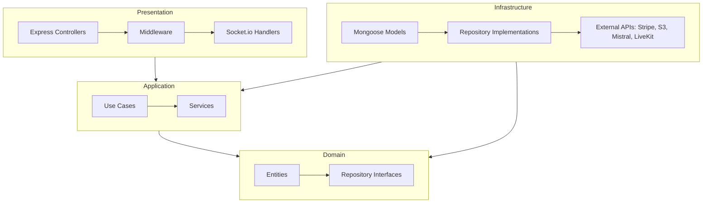

# 🏋️‍♂️ Fitora - Virtual Personal Training & Wellness Marketplace

Fitora is a modern, premium virtual wellness and fitness marketplace that connects professional trainers with clients. The platform enables real-time workout video sessions, AI-generated fitness and nutrition planning, custom training packages, and full administrative/financial controls.

## 🚀 Key Features

### 👤 For Clients
- **Personalized Onboarding:** Health and fitness questionnaires to capture physical metrics, fitness levels, dietary preferences, and target goals.
- **AI-Powered Plans:** Instant generation of weekly custom workout routines and nutrition/diet schedules using **Mistral AI**.
- **Trainer Search & Booking:** Explore trainers by their specializations, view available calendar slots, and book virtual 1-on-1 sessions.
- **Interactive Live Sessions:** Experience real-time video/audio workout coaching sessions powered by **LiveKit (WebRTC)**.
- **Subscriptions & Billing:** Easy payments and subscription management powered by **Stripe**, complete with purchase history and billing states.
- **Progress Analytics:** Dynamic charts tracking health metrics and session history.

### 👟 For Trainers
- **Comprehensive Dashboard:** Interactive charts showing client counts, weekly workload, and total revenue.
- **Slot Scheduling:** Flexible tool to create and manage upcoming session slots for clients to book.
- **Client Management:** Track assigned client lists, progress, and review notes.
- **Trainer Wallet:** Dedicated wallet showcasing earnings history and payout logs.

### 🛡️ For Administrators
- **User Management:** Access profiles, search, block/unblock, and track statuses of all users.
- **Trainer Verification:** Review professional credentials and verify/approve trainers to join the marketplace.
- **Finance Dashboard:** Platform-wide financial reporting, including commission rates, payouts, and subscriptions.
- **Reporting System:** Track and review reported sessions or user behavior to ensure platform safety.

---

## 🛠️ Technology Stack

| Component | Technology | Description |
| :--- | :--- | :--- |
| **Frontend** | React (v19) + Vite | Next-generation single page application framework |
| | TypeScript | Safe, static-typed development |
| | Tailwind CSS (v4) | Utility-first responsive styles |
| | Zustand | High-performance, lightweight state management |
| | Framer Motion | Smooth, premium transitions and animations |
| | Recharts | Dynamic interactive charting and progress tracking |
| **Backend** | Node.js + Express | Fast, non-blocking asynchronous server environment |
| | TypeScript | Static typing throughout API routes, services, and models |
| | Socket.io | Real-time web-sockets for immediate notifications |
| | Bull Queue | Redis-backed background job queue for asynchronous work |
| | Mongoose | Elegant MongoDB object modeling and database schemas |
| **Database** | MongoDB | NoSQL document storage for users, slots, logs, and plans |
| | Redis | High-speed cache and Bull job queue broker |
| **Services** | LiveKit | SFU WebRTC real-time video and audio communication |
| | Stripe | Payment gateways, webhook handling, and subscription logic |
| | Mistral AI | Generation of structured, varied, and personalized diet/workout plans |
| | AWS S3 | Cloud media storage for trainer credentials and profiles |
| | NodeMailer | Automated transactional email notifications |

---

## 📂 Project Architecture

The backend follows the principles of **Clean Architecture** to separate concerns and decouple business logic from external frameworks:


- **Domain:** Core enterprise business entities, types, and repository interfaces (independent of database or frameworks).
- **Application:** Application-specific business rules, orchestrating flow to and from the domain entities.
- **Infrastructure:** Framework implementations, database schemas (Mongoose), cache, and third-party integrations (Stripe, LiveKit, S3).
- **Presentation:** Entry point to the app. Express routes, controllers, middleware, and socket-connection managers.


---

## 🛠️ Installation & Setup

### Option 1: Standalone Running (Local Development)

#### 1. Backend Server
1. Navigate to the server folder:
   ```bash
   cd server
   ```
2. Install dependencies:
   ```bash
   npm install
   ```
3. Run in development mode (using nodemon):
   ```bash
   npm run dev
   ```
4. Build for production:
   ```bash
   npm run build
   npm start
   ```

#### 2. Frontend Client
1. Navigate to the client folder:
   ```bash
   cd client
   ```
2. Install dependencies:
   ```bash
   npm install
   ```
3. Run the development server (Vite):
   ```bash
   npm run dev
   ```
4. Build for production:
   ```bash
   npm run build
   ```

---

### Option 2: Running with Docker Compose (Recommended for Backend + Cache)

To orchestrate the server and its Redis caching/job queue dependencies effortlessly, you can use the configured Docker setup:

1. Make sure Docker is running on your machine.
2. Navigate to the server directory:
   ```bash
   cd server
   ```
3. Spin up the containers:
   ```bash
   docker-compose up --build
   ```
This commands builds the backend node environment and pulls the Redis alpine image, mapping the server to port `4000` and Redis to port `6379`.


## 📜 License
This project is licensed under the ISC License.
